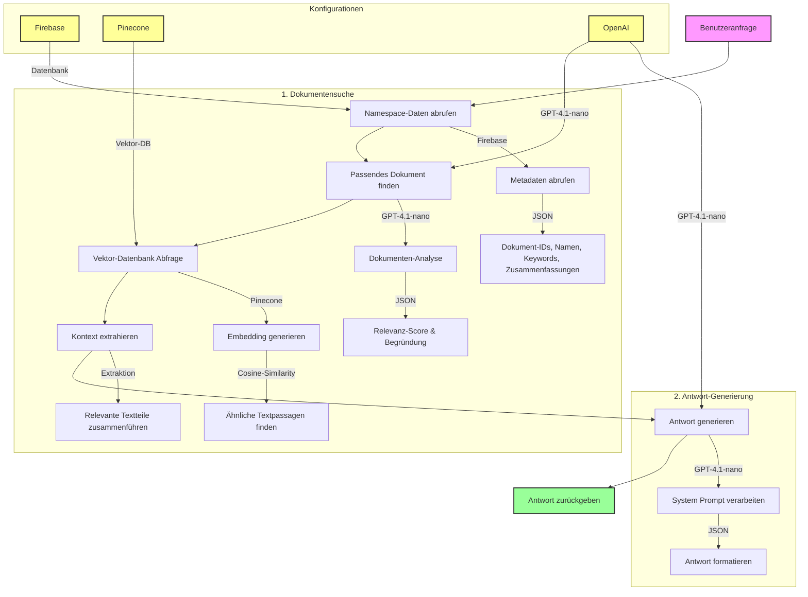

```mermaid
flowchart TD
    A[Benutzeranfrage] --> B[Namespace-Daten abrufen]
    B --> C[Passendes Dokument finden]
    C --> D[Vektor-Datenbank Abfrage]
    D --> E[Kontext extrahieren]
    E --> F[Antwort generieren]
    F --> G[Antwort zurückgeben]

    subgraph "1. Dokumentensuche"
        B -->|Firebase| B1[Metadaten abrufen]
        B1 -->|JSON| B2[Dokument-IDs, Namen, Keywords, Zusammenfassungen]
        
        C -->|GPT-4.1-nano| C1[Dokumenten-Analyse]
        C1 -->|JSON| C2[Relevanz-Score & Begründung]
        
        D -->|Pinecone| D1[Embedding generieren]
        D1 -->|Cosine-Similarity| D2[Ähnliche Textpassagen finden]
        
        E -->|Extraktion| E1[Relevante Textteile zusammenführen]
    end

    subgraph "2. Antwort-Generierung"
        F -->|GPT-4.1-nano| F1[System Prompt verarbeiten]
        F1 -->|JSON| F2[Antwort formatieren]
    end

    subgraph "Konfigurationen"
        K1[Firebase] -->|Datenbank| B
        K2[Pinecone] -->|Vektor-DB| D
        K3[OpenAI] -->|GPT-4.1-nano| C
        K3 -->|GPT-4.1-nano| F
    end

    style A fill:#f9f,stroke:#333,stroke-width:2px
    style G fill:#9f9,stroke:#333,stroke-width:2px
    style K1 fill:#ff9,stroke:#333,stroke-width:2px
    style K2 fill:#ff9,stroke:#333,stroke-width:2px
    style K3 fill:#ff9,stroke:#333,stroke-width:2px
``` 